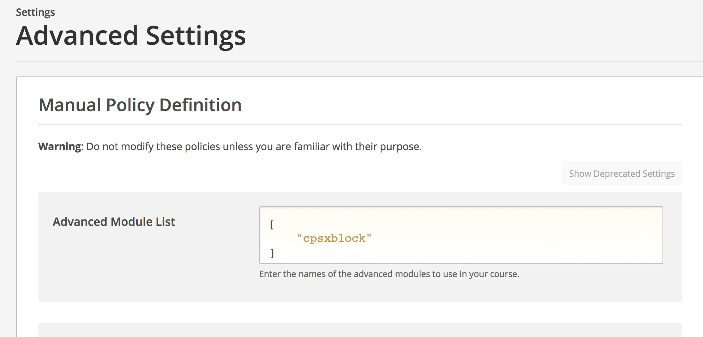

# CPSXBLOCK

 An xblock for the open-edx platform that allows real-time collaboration tools for students

## Installing CPSXBlock

Step 1: Login to your edx-instance,  
Note: this Xblock has been tested to work with the latest edx ginko instance

Step 2: 
<pre>
git clone "https://github.com/collabassess/cpsx_scripts.git"
cd cpsx_scripts
./install_cpsx.sh
</pre>

Step 3: Go to your edx instance -> ip-address:18010   or url:18010

Step 4: Go to course -> settings -> Advanced Settings

Step 5: In advanced module list -> add "cpsxblock"

## Updating CPSXBlock
<pre>
cd cpsx_scripts
./update_cpsx.sh
</pre>

## Removing CPSXBlock
<pre>
cd cpsx_scripts
./uninstall_cpsx.sh
</pre>